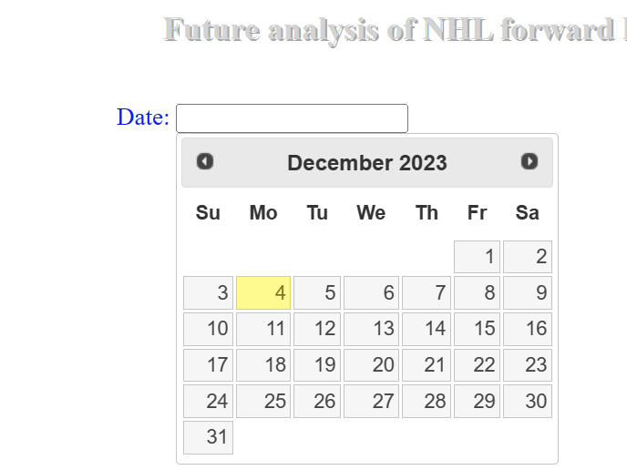
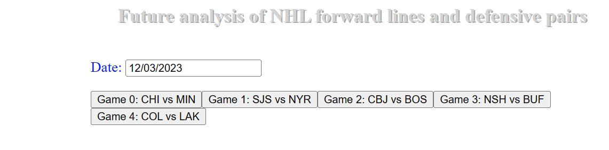
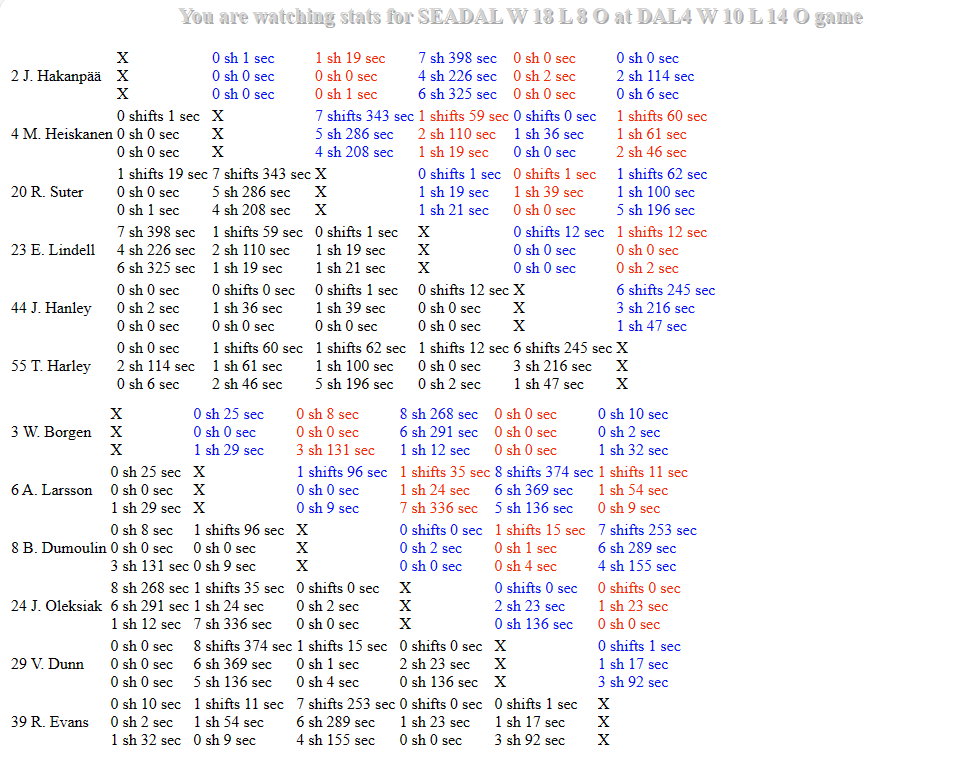
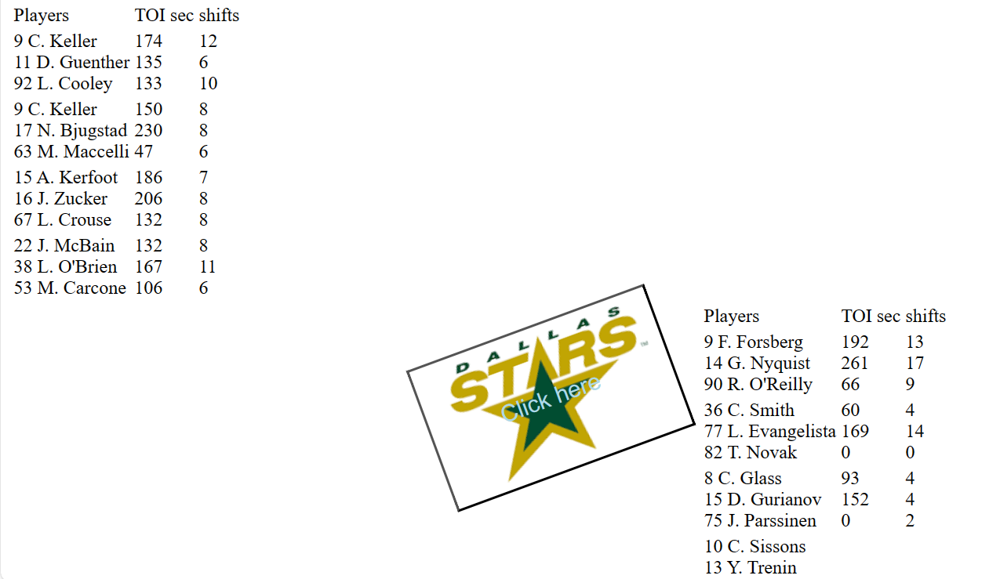

# NHLShiftsStats3
## Background
Original repo is located at https://github.com/umnovjp/NHLShiftStats1. It was working in 98% of games. But with NHL changing its APIs without any announcement I realized that it was better to start new repo from scratch instead of fixing original one. One of the reasons is that trying to fix issues with original repo created too many new hurdles. Like fixing one led to a new one. And as script progressed, I knew I am on the right path after 2 years of JavaScript experience. What I could not accomplish with 1200 lines of code last year, I did with just 400 lines. Compare script.js files! Another NHL stats repo https://github.com/umnovjp/NHLShiftStats1 will be easier to fix.
## Usage
First thing is to select a date. And remember to select date when games actually were played.  
Then you will be prompted to select a game. Press one button to select a game.  Separate tables will be displayed for home and away team defensemen.  You can easy determine defensive pairs from this table. It is not that easy for forward lines. Because lines of three forwards are not that easy to display in a 2D table. This is how it is done currently . Also, special teams are frequently played with 2 or 4 forwards depending on if it is penalty kill or power play. This script limits 5x5 play as play with 2D and 3F only. This is done to exclude PP with 4F and 1 D. Still it includes PP with 3F and 2D. 

Definition of shift is 10 seconds pair of defensmen or trio of forwards played continuously at the same time. 
## Known Failures
Some game data are not displayed correctly because of obvious errors in NHL API data. Example is STL at FLA game on 12/21/2023 where data for many shifts are duplicated. Similar example is TOR at CBJ game on 12/23/2023 where many shifts are duplicated while some non existing overlapping shifts are added. Game CBJ at NJD on 12/28/2023 generated unreliable results for DMen because there were 3 of them on ice frequently. Most likely one D(#2?) was dressed as an F, but game report still counts him as D. Game 4 on 01/09 A has 3 lines only with 12F. Game 1 on 1/14 only 3 h lines are displayed because 3 played on 2 lines. game 8 on 1/15 only 3 lines displayed. game 6 on 1/16 determines lines correctly. but toi is absolutely wrong. on 1/21 game 0 H lines are incorrect because #11 played on 2 lines. game 0 on 01/29 12 F but only 11 displayed. And for H team, all lines changed in 2nd. Game 4 on 01/09: A lines displayed incorrectly with #14, #16, #19 playing on 2 lines; and only 3 lines. Game 10 on 01/06 A has 11F but #28, #81, #91 played for 2 lines. Game 1 on 12/29 has terrible shift data for A team. Game 10 on 12/27 #11 and #16 play on two lines. Game 8 on 12/21 #97 played on 2 lines. game 0 on 12/14 #26 played on 2 lines. Game 2 on 12/14 H only one line displayed. Game 3 on 12/12 #63 and #25 played on two lines. game 4 on 12/9 all H lines undefined because there was no one line. Game 2 on 12/03 only 3 lines displayed but #15 plyed on 4th line as well. Game 9 on 12/02 #17 played on 2 lines. Game 0 on 12/01 3 lines displayed #28 played on 2 lines. Game 4 on 11/28 only 1 line H displayed. Game 5 on 11/27 #24 A played on 2 lines. Game 3 on 11/25 A #19 played on 2 lines. Game 2 on 11/22 only 1 lines displayed. Game 3 on 11/22 3 H lines displayed but #19 played on 2 lines. Game 6 11/22 #9 played on 2 A lines. Game 13 11/22 only 3 A lines displayed because #10 and #48 both played on 2 lines. Game 0 on 11/20 3 lines displayed, #19 and #23 played on 2 lines. Game 3 on 11/20 one line dispalyed; on A team #20 plyed for 2 lines. Game 3 on 11/18 1 line displayed. 

on 1/31 checked 11/18 to 1/31.

Summary of January 2024. 48 + 50 + 53 + 51 + 6 = 208 games. December 34 + 54 + 53 + 33 + 45 = 219 games. 

9 Games in January and 5 games in December with 5 lines: Game 10 on 01/02 H had 5 lines 1810 345 7911 are unique. Game 1 on 01/31 H have 5 lines and 3 unique lines. Game 2 on 01/07 A has 5 lines 268 is the only unique line. Game 4 on 01/27 has 5 lines incorrectly only 5910 line is unique. Game 2 on 1/25 H has 5 lines incorrectly 017 268 are unique. Game 3 on 1/19 has 5 limes correct 056 348 are unique. Game 3 on 1/20 A ahas 5 lines incorrect 138 2410 are unique. game 10 on 1/18 H has 5 lines. 0611 578 are unique lines. game 0 on 1/15 had 5 lines calculated correctly 236 and 4510 are unique. Game 0 on 12/23 5 lines 0311 467 are unique. Game 1 on 12/23 268 91011 are unique. Game 0 on 12/18 025 467 are unique. Game 1 on 12/10 068 157 lines are unique. Game 3 on 12/6 A 5 lines 068 5910 are unique. Game 13 on 11/30 179 3410 are unique. Game 7 on 11/28 A two unique lines. Game 9 on 11/28 A has 3 unique lines. Game 0 on 11/27 H has 3 unique lines. Game 3 on 11/24 2 unique lines. Game 5 on 11/24 A 3 unique lines. 

11F playing in 3 or 4 lines 5 times in January and 3 or more times in December. Currently game 3 on 01/04 displays 4 lines because H team had 7 Ds but #71 belongs to 2 lines. Game 3 on 01/04 11F but #71 played on 2 lines. on 1/22  game 3 H team 11F #9 played on 2 lines. game 3 on 1/18 #11 played on two lines for 11F home team. Game 9 on 1/13 A has 3 lines with 7D. Game 6 on 12/29 11F but 4 lines. game 9 on 12/9 displays #13, #96, #29 all playing on two lines. Game 12 on 12/7 #15 played on two lines. 